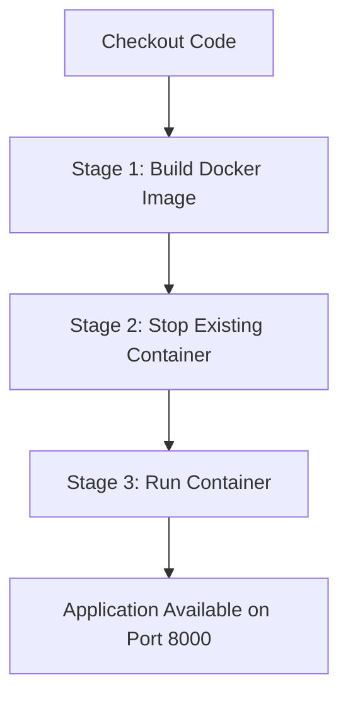

# 🎓 Student Attendance System

[](https://www.python.org/)
[](https://flask.palletsprojects.com/)
[](https://www.docker.com/)
[](https://www.jenkins.io/)

A responsive, lightweight **Flask web application** designed to simplify student attendance management. It features a complete pipeline for marking attendance, managing students, viewing history, containerizing with Docker, and CI/CD deployment with Jenkins.

---

## 🌟 Key Features

*   📝 **Mark Attendance:** User-friendly web form to mark daily attendance (Present/Absent) with real-time date and time display.
*   📊 **Attendance Summaries:** Instantly view statistics (total students, count of present, count of absent) upon submission.
*   👥 **Student Directory:** Add new students with automated roll-number generation, and delete existing records.
*   📅 **Historical Logs & Analytics:** View overall student attendance statistics (Student ID, Name, Present, Absent, Attendance %) and clean up past records.
*   💾 **Automatic Storage:** Data persistence using secure local JSON structures under the `data/` directory.
*   🐳 **Containerized Setup:** Fully dockerized application ready to run on any host environment.
*   🔄 **CI/CD Integration:** Ready-to-go Jenkins pipeline setup to automate builds, container teardowns, and fresh deployments.

---

## 🛠️ Technology Stack

| Component | Technology / Tool | Purpose |
| :--- | :--- | :--- |
| **Backend Framework** | Python 3 (Flask >= 3.0.0) | Handles routing, business logic, and JSON file operations. |
| **Frontend UI** | HTML5, CSS3, Jinja2 Templates | Responsive grid layout, sleek tables, and visual states. |
| **Data Engine** | JSON Flat Files | Lightweight storage for students and attendance logs. |
| **Containerization** | Docker | Packaging the application into a reproducible environment. |
| **Automation & CI** | Jenkins Pipeline | Automates build and container lifecycle stages. |
| **API testing** | Postman | Configured for collection imports and API validation. |

---

## 📁 Project Structure

```text
DevOps_Project/
├── app.py                  # Main Flask application containing controllers and API routes
├── requirements.txt        # Python dependency declarations
├── Dockerfile              # Instructions for building the container image
├── Jenkinsfile             # Jenkins pipeline automation script (Build -> Teardown -> Deploy)
├── static/
│   └── style.css           # Custom CSS for styling the attendance dashboards
├── templates/              # Jinja2 templates for rendering HTML
│   ├── base.html           # Shared layout layout with navbar, container, and flash messages
│   ├── index.html          # Dashboard for marking attendance
│   ├── summary.html        # Page showing the immediate result of attendance submission
│   ├── history.html        # Historical records log table
│   └── students.html       # Student management page (Add/Remove students)
├── data/                   # Automatically created directory for local file storage
│   ├── students.json       # Persisted student database
│   └── attendance.json     # Persisted attendance records history
└── postman/                # Local postman collections configuration
    └── ...                 
```

---

## 🚀 Getting Started

### Prerequisites

Ensure you have the following installed on your machine:
*   [Python 3.9+](https://www.python.org/downloads/)
*   [Docker](https://docs.docker.com/get-docker/) (Optional, for container run)
*   [Jenkins](https://www.jenkins.io/) (Optional, for CI/CD)

---

### Method 1: Local Setup

1.  **Clone the repository and navigate inside:**
    ```bash
    git clone <repository-url>
    cd DevOps_Project
    ```

2.  **Create and activate a virtual environment:**
    ```bash
    python3 -m venv venv
    source venv/bin/activate
    ```

3.  **Install dependencies:**
    ```bash
    pip install -r requirements.txt
    ```

4.  **Run the Flask application:**
    ```bash
    python app.py
    ```

5.  **Access the application:**
    Open [http://127.0.0.1:8000](http://127.0.0.1:8000) or [http://127.0.0.1:5000](http://127.0.0.1:5000) in your web browser.

---

### Method 2: Docker Setup

You can build and deploy the containerized version of the app in one command:

1.  **Build the Docker image:**
    ```bash
    docker build -t attendance-app .
    ```

2.  **Run the container:**
    ```bash
    docker run -d --name attendance-container -p 8000:8000 attendance-app
    ```
    *Note: The port `8000` on your host maps to the default port `8000` inside the container.*

3.  **Stop and clean up the container:**
    ```bash
    docker stop attendance-container
    docker rm attendance-container
    ```

---

### Method 3: CI/CD Pipeline (Jenkins)

The project includes a multi-stage `Jenkinsfile` for automated integration and deployment. The pipeline stages execute the following processes:



1.  **Build Docker Image:** Compiles `Dockerfile` into `attendance-app` container image.
2.  **Stop Existing Container:** Stops and removes running containers named `attendance-container` to release the port mapping safely.
3.  **Run Container:** Boots a new background container named `attendance-container` on port `8000`.

---

## 🔌 API Endpoints Summary

| Endpoint | Method | Description |
| :--- | :--- | :--- |
| `/` or `/take-attendance` | `GET` | Renders the primary form to mark attendance. |
| `/submit` | `POST` | Processes the attendance form, saves results, and renders the summary dashboard. |
| `/students` or `/manage-students` | `GET` | Displays the list of currently registered students. |
| `/students/add` | `POST` | Registers a new student and generates a sequential roll number. |
| `/students/delete` | `POST` | Deletes a student from the register by name. |
| `/history` or `/view-history` | `GET` | Displays all historical logs of attendance. |
| `/history/delete` | `POST` | Deletes a specific historical record (matched by date and time). |

---

## 📝 Customization & Initial Data

On the first launch, if no `students.json` is found inside the `data/` directory, the system automatically populates a default list of students:
*   Alice Johnson (Roll No. 1)
*   Bob Smith (Roll No. 2)
*   Charlie Brown (Roll No. 3)
*   Diana Prince (Roll No. 4)
*   Ethan Hunt (Roll No. 5)
*   Fiona Green (Roll No. 6)
*   George Miller (Roll No. 7)

Any additions or deletions are saved automatically to `data/students.json` and persist across restarts.
